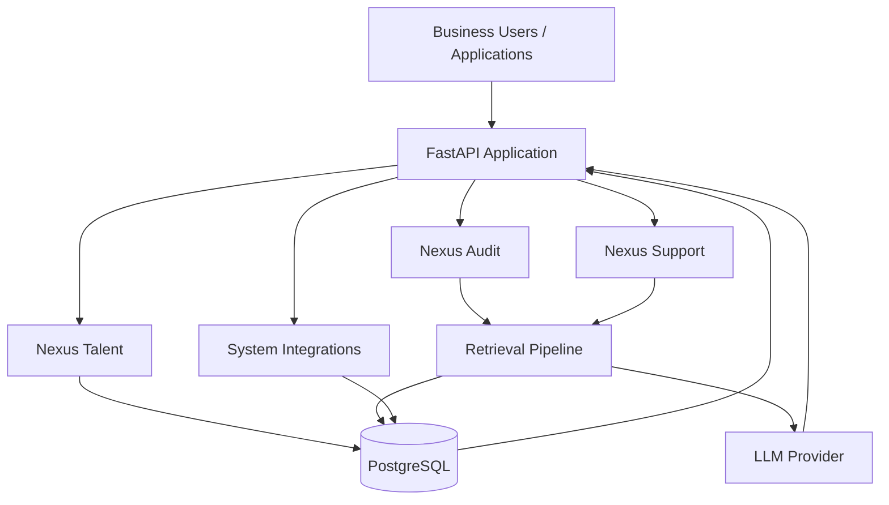

# Nexus Enterprise AI

**Enterprise AI platform for recruitment, financial document auditing, and customer support.**

Nexus Enterprise AI is a modular business AI platform that demonstrates how large language models, retrieval-augmented generation (RAG), structured business workflows, and enterprise data systems can be combined into practical internal applications.

The platform is organized around three business modules:

- **Nexus Talent** — recruitment intelligence and structured candidate evaluation
- **Nexus Audit** — financial-document analysis, auditing, and knowledge retrieval
- **Nexus Support** — customer-service assistance grounded in business knowledge

> **Portfolio project:** This repository demonstrates an end-to-end enterprise AI architecture rather than a production deployment for a real organization.

---

## 1. Overview

### The business problem

Organizations often have valuable information distributed across resumes, financial documents, internal policies, product knowledge, and customer-support material. Traditional workflows require employees to manually search documents, compare information, and repeatedly perform structured tasks.

This creates several problems:

- Information is difficult to find quickly.
- Manual document review is repetitive and time-consuming.
- Business decisions can depend on inconsistent evaluation processes.
- Customer-support teams need fast access to accurate internal knowledge.
- Generic LLM chat interfaces do not automatically understand company-specific context.

### The solution

Nexus Enterprise AI provides a common backend and AI architecture for several business workflows.

Instead of treating AI as a standalone chatbot, the platform connects:

**Business workflow → API layer → data/retrieval layer → LLM → structured result**

The same architectural foundation can therefore support different enterprise use cases while keeping domain-specific workflows separated into modules.

### Intended users

The platform is designed as a reference architecture for:

- HR and recruitment teams
- Finance and audit teams
- Customer-support teams
- Internal operations teams
- Developers building enterprise LLM applications

---

## 2. Modules

### Nexus Talent

**Recruitment intelligence and blind evaluation**

**Workflow**

`Candidate input → Document processing → Information extraction → Structured evaluation → Recruiter review`

Capabilities demonstrated:

- Candidate/resume information processing
- Structured candidate profiles
- Blind-evaluation workflow
- AI-assisted candidate analysis
- Consistent evaluation criteria
- Human review before hiring decisions

The goal is to assist recruiters with structured analysis, not replace human hiring decisions.

---

### Nexus Audit

**Financial document auditing and knowledge retrieval**

**Workflow**

`Financial documents → Document ingestion → Retrieval → AI analysis → Audit findings`

Capabilities demonstrated:

- Financial-document ingestion
- Knowledge-base retrieval
- Document-grounded AI analysis
- Structured audit outputs
- Evidence-oriented review workflow
- Support for comparing information across business documents

The retrieval layer is intended to reduce unsupported LLM responses by grounding analysis in relevant source material.

---

### Nexus Support

**Customer-service knowledge platform**

**Workflow**

`Customer question → Knowledge retrieval → LLM response → Source-grounded answer`

Capabilities demonstrated:

- Customer-support question handling
- Retrieval from business knowledge
- Context-aware LLM responses
- Structured API access
- Centralized knowledge architecture

The module is designed for support-assistant scenarios where responses should be based on approved business information rather than general model knowledge alone.

---

## 3. Architecture

### High-level architecture



### Core components

| Layer | Technology / Component | Responsibility |
|---|---|---|
| API | **FastAPI** | REST API and business workflow orchestration |
| Database | **PostgreSQL** | Persistent application and business data |
| AI | **LLM provider** | Natural-language reasoning and generation |
| Retrieval | **Retrieval pipeline / RAG** | Finds relevant business context before generation |
| Application modules | **Nexus Talent / Audit / Support** | Domain-specific workflows |
| Integrations | **External/internal system integrations** | Connects workflows to supporting services |
| Deployment | **Docker Compose** | Reproducible local development environment |

### Request flow

1. A user or application sends a request to the FastAPI backend.
2. FastAPI routes the request to the appropriate Nexus module.
3. The module retrieves relevant structured data and/or documents.
4. The retrieval pipeline supplies relevant context to the LLM.
5. The LLM produces an analysis or response.
6. The backend returns a structured result to the client.

---

## 4. Setup and Demo

### Prerequisites

Install:

- [Docker](https://www.docker.com/)
- Docker Compose v2 (`docker compose`)
- Git

No local Python or PostgreSQL installation is required when using the provided Docker environment.

### 4.1 Clone the repository

```bash
git clone <https://github.com/Gallaxz-lab/nexus-enterprise-ai>
cd nexus-enterprise-ai
```

### 4.2 Configure environment variables

Create a local environment file from the example:

```bash
cp .env.example .env
```

Then edit `.env` and provide the required configuration for your local environment.

**Never commit `.env` to Git.**

Example:

```env
DATABASE_URL=postgresql://<user>:<password>@postgres:5432/<database>
LLM_API_KEY=<your-api-key>
LLM_MODEL=<your-model>
```

Use the actual variable names already defined by this project in `.env.example`.

### 4.3 Start the application

```bash
docker compose up --build
```

Run in detached mode if preferred:

```bash
docker compose up --build -d
```

Check running containers:

```bash
docker compose ps
```

View application logs:

```bash
docker compose logs -f
```

Stop the environment:

```bash
docker compose down
```

### 4.4 Database reset

For a clean local environment:

```bash
docker compose down -v
docker compose up --build
```

> `-v` removes Docker volumes, including persisted local database data. Do not use it if you need to keep your local data.

### 4.5 API documentation

When the FastAPI service is running, open the automatically generated API documentation:

```text
http://localhost:8000/docs
```

Alternative ReDoc interface:

```text
http://localhost:8000/redoc
```

If the project exposes the API on a different port, use the port configured in `docker-compose.yml`.

### 4.6 Sample data

The repository should use synthetic/demo data for portfolio demonstrations.

Recommended demo flow:

1. Start the Docker environment.
2. Load the included sample data or seed the database.
3. Open the API documentation.
4. Select a Nexus module.
5. Submit a sample request.
6. Inspect the structured response.
7. Repeat the workflow with another module.

**Do not use real candidate information, customer records, financial records, credentials, or other private business data in the public repository.**

---

## 5. Limitations and Future Improvements

### Implemented / demonstrated

The current portfolio implementation focuses on demonstrating:

- Modular enterprise AI workflows
- FastAPI backend architecture
- PostgreSQL-backed application data
- LLM integration
- Retrieval-augmented workflows
- Domain-specific AI modules
- Docker-based local deployment
- API-first access to the platform

### Planned improvements

The following should be treated as future enhancements rather than current capabilities unless implemented elsewhere in the repository:

- Production authentication and role-based access control
- Fine-grained document permissions
- Full audit logging and observability
- Automated evaluation of LLM responses
- Retrieval quality benchmarks
- Reranking and hybrid retrieval optimization
- Background job processing for large document sets
- Automated document ingestion pipelines
- Production-grade rate limiting and API security
- Automated testing and CI/CD
- Cloud deployment
- Model/provider failover
- Cost and token monitoring
- Human approval workflows for high-impact actions

### Important scope note

Nexus is a portfolio/reference implementation. It should not be presented as a production-ready enterprise system unless the relevant security, privacy, reliability, monitoring, testing, and compliance controls have been implemented and validated.

---

## Portfolio Summary

**Nexus Enterprise AI** demonstrates an end-to-end approach to building business-focused LLM applications: API development, relational data management, retrieval-augmented generation, modular workflow design, containerized deployment, and enterprise-oriented AI architecture.
